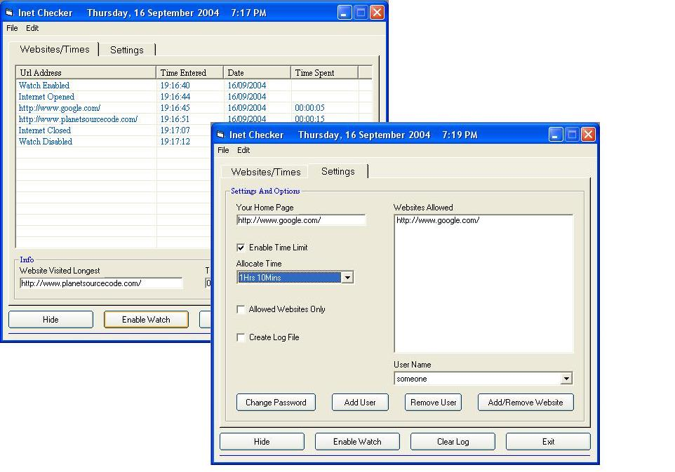



## Internet checker, see screen shot

### Description

use to watch the sites visited, allocate time spent on the net, create a log file, hide in the system tray. uses password so you have control over the program. added the use of adding more users with there own set of websites they can visit.
 
### More Info
 

             |
---                |---
**Submitted On**   |2004-09-15 23:57:34
**By**             |[stephen whittle](https://github.com/Planet-Source-Code/PSCIndex/blob/master/ByAuthor/stephen-whittle.md)
**Level**          |Intermediate
**User Rating**    |4.8 (24 globes from 5 users)
**Compatibility**  |VB 6\.0
**Category**       |[Files/ File Controls/ Input/ Output](https://github.com/Planet-Source-Code/PSCIndex/blob/master/ByCategory/files-file-controls-input-output__1-3.md)
**World**          |[Visual Basic](https://github.com/Planet-Source-Code/PSCIndex/blob/master/ByWorld/visual-basic.md)
**Archive File**   |[Internet\_c1794709162004\.zip](https://github.com/Planet-Source-Code/stephen-whittle-internet-checker-see-screen-shot__1-56221/archive/master.zip)

